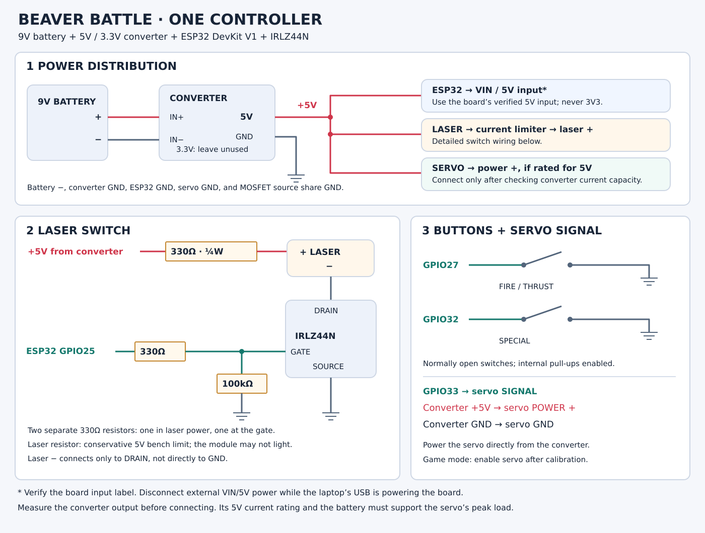

# Controller wiring

Use the GPIO labels printed on the classic ESP32 DevKit V1, not physical header positions. Assign distinct firmware IDs for game controllers. **Current rewired bench board:** steady laser button D14/GPIO14 to GND, pulsing button D27/GPIO27 to GND, laser gate D25/GPIO25. Set `CONFIG_BB_FIRE_GPIO=14` and `CONFIG_BB_SPECIAL_GPIO=27`. The diagram below shows the earlier GPIO27/GPIO32 button layout; use this override for the current board.



## Power from the converter

Connect battery positive to converter IN+ and battery negative to IN−. Use its regulated **5 V output** for the board's verified VIN/5V input, the laser branch below, and the servo only if it is rated for 5 V. Leave the converter's **3.3 V output unconnected**; the ESP32 board makes its own 3.3 V. Measure the converter output before connecting the devices. Keep the external positive supply disconnected from the board's VIN/5V while laptop USB is powering it until the exact board's power isolation is verified.

All grounds connect together: battery negative, converter ground, ESP32 GND, MOSFET source, and servo ground. Run servo power and ground directly to the converter supply connections rather than through the ESP32 board. The converter model and current rating remain unknown. Confirm it and the battery can supply the servo's startup/stall current plus the ESP32 and laser loads before connecting the servo. A module with both 5 V and 3.3 V outputs is not necessarily a switching converter; linear modules can dissipate substantial heat. For example, dropping 9 V to 5 V at 0.5 A dissipates 2 W.

| Signal | Connection |
| --- | --- |
| Fire/thrust | GPIO27 → normally open button → GND |
| Special | GPIO32 → normally open button → GND |
| Laser control | GPIO25 → 330 Ω gate resistor → N-channel MOSFET gate |
| Servo signal | GPIO26 → servo signal input |
| Common ground | ESP32 GND, MOSFET source, servo ground, external supply negative |

Buttons use internal pull-ups and 15 ms debounce. They do not connect to 5 V. For four-legged switches, use contacts that are open when released and short together when pressed.

The servo's positive power wire goes to its rated supply, not GPIO26 or the laser switch. **D26 is GPIO26**, the servo signal pin. Normal game firmware leaves servo pulses disabled until its rest/press positions are configured and enabled; the explicit servo bench test below enables pulses for calibration. Do not connect raw 9 V to GPIO, 3V3, or the shown 5 V rail.

## Laser current limit

The reported laser specification is 5 V and at most 20 mA. This does not establish whether it is a bare diode or a module with a driver, nor its actual diode forward voltage. Identify the part before treating 5 V as a direct-drive voltage. A purpose-built laser current driver should keep operating current below the rated maximum, including tolerance and transients.

With the available resistors, **330 Ω ±5%, ¼ W in series with the laser supply** is a conservative steady-current limit for a regulated 5 V bench test. This is a second resistor, separate from the MOSFET gate resistor:

```text
regulated +5 V → 330 Ω current-limit resistor → laser (+)
laser (−) → IRLZ44N drain
IRLZ44N source → common GND
GPIO25 → 330 Ω gate resistor → IRLZ44N gate
IRLZ44N gate → 100 kΩ pull-down → IRLZ44N source/GND
```

Even with zero laser/switch voltage drop, current is at most `5.25 V / (330 Ω × 0.95) = 16.75 mA`, allowing a 5% high supply and 5% low resistor. Maximum resistor dissipation under that assumption is about 0.088 W. The resistor may leave insufficient voltage for the laser to operate; it is not a constant-current driver. This bound assumes the supply never exceeds 5.25 V, correct polarity, and the resistor is actually in series.

Once diode and switch drops are known, the nominal relation is `R = (Vsupply − Vlaser − Vswitch) / I`, with component and supply tolerances included. A 5 V-rated module that actually needs nearly 5 V cannot also receive a large series voltage drop from a 5 V source. Do not remove current limiting merely because it does not light. See [Wavelength Electronics' current-limit calculation](https://www.teamwavelength.com/faq/faq1079/).

The available IRLZ44N is a switch, not a voltage or current regulator. Its specified low on-resistance starts at 4 V gate drive; 3.3 V operation is reasonable to test at this small laser current, but verify the on-state drain-to-source voltage. Check the exact manufacturer's drain/gate/source lead diagram; the drawing labels electrical connections, not physical leg positions. Do not connect laser negative directly to ground as well, which would bypass the MOSFET. See the [IRLZ44N datasheet](https://www.infineon.com/assets/row/public/documents/24/49/infineon-irlz44n-datasheet-en.pdf).

## Button monitor

Flash the controller build, then open a 115200-baud serial monitor. Each press/release reports `FIRE GPIO27 PRESSED/RELEASED` or `SPECIAL GPIO32 PRESSED/RELEASED`. This works with empty Wi-Fi credentials. In the normal game build, the laser stays off without host commands, and servo output is disabled by default. Close the monitor before the next firmware upload.

For the standalone laser test, enable `CONFIG_BB_LASER_BUTTON_TEST` as described in [firmware instructions](firmware.md). Holding either button turns GPIO25 on; releasing both turns it off after debounce. This mode does not use Wi-Fi or the game and always disables the servo. Disable the test option and reflash before returning to the game.

For the standalone positional-servo test, enable `CONFIG_BB_SERVO_BUTTON_TEST` and disable the laser test. Holding D27 moves toward a lower pulse width; holding D32 moves toward a higher pulse width. Neither button or both buttons holds the current commanded position. The laser remains off. The shared defaults start at 1500 microseconds, with limited 1200–1800 microsecond travel and 5-microsecond steps every 20 ms.

The user-authorized broad travel test for the ANKONGRC SG90 uses local settings `CONFIG_BB_SERVO_TEST_MIN_US=544`, `CONFIG_BB_SERVO_TEST_MAX_US=2400`, and `CONFIG_BB_SERVO_TEST_STEP_US=25`. At 25 microseconds per 20 ms, traversing this range takes about 1.5 seconds of commanded movement. The endpoints match the [Arduino Servo library defaults](https://github.com/arduino-libraries/Servo/blob/master/src/Servo.h); they are a practical test range, not verified ANKONGRC mechanical limits or a guaranteed angle. If the servo binds or buzzes at an endpoint, use the opposite button to back away and narrow that limit. See [firmware instructions](firmware.md) for adjustment.
